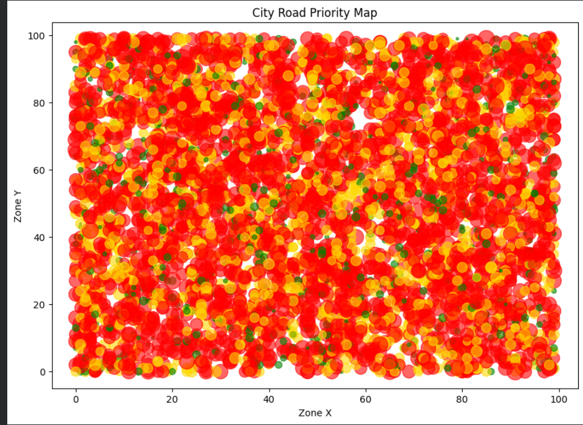
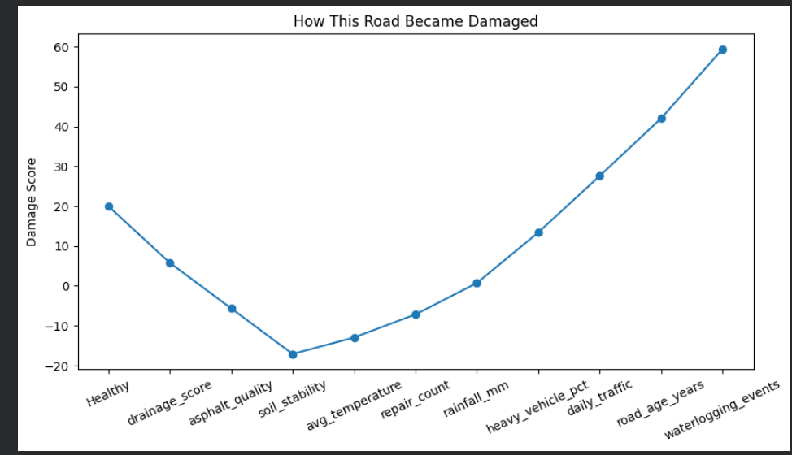
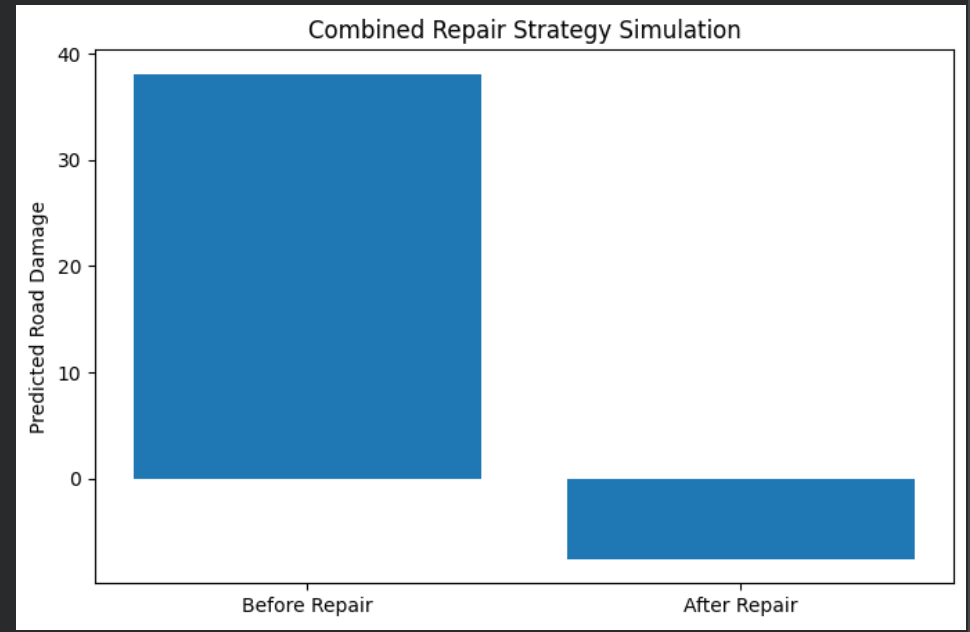
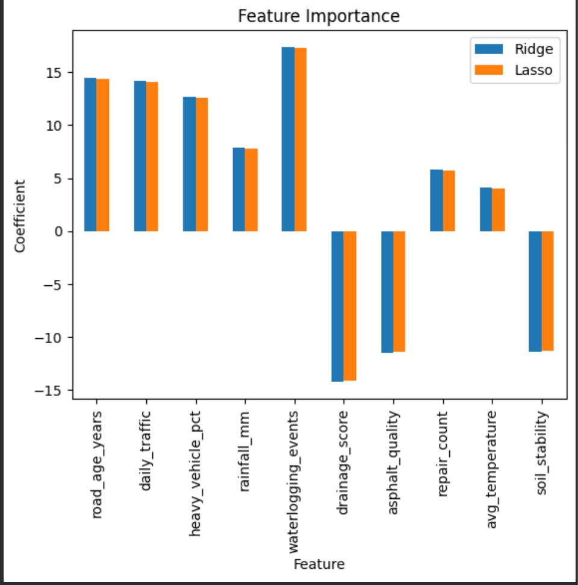
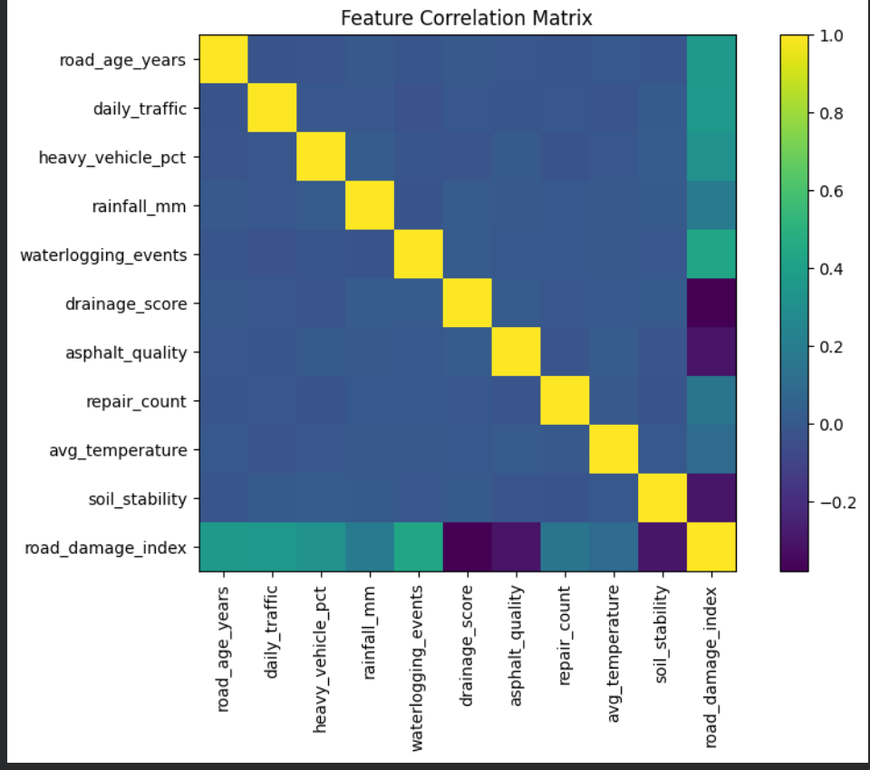
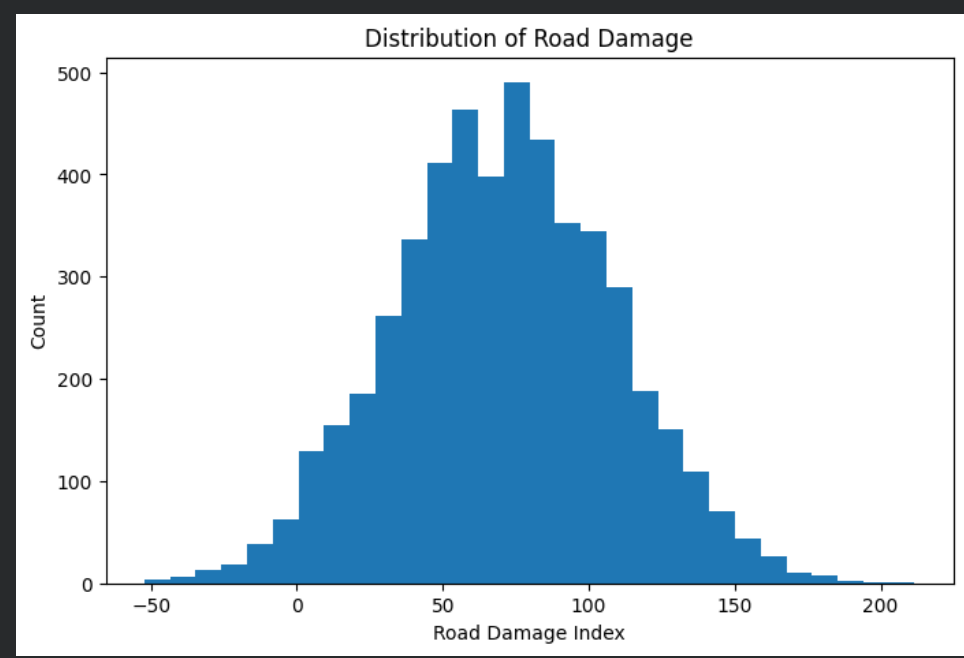

<div align="center">

# ⬡ VIASTRA

### AI-Powered Road Infrastructure Intelligence Platform

<p>
  
  
  
  
  
  
</p>

<p>
  <a href="https://viastra.streamlit.app/" target="_blank"><strong>🎬 Demo</strong></a>
  <a href="#architecture"><strong>🏗 Architecture</strong></a> ·
  <a href="#model-performance"><strong>📊 Model Performance</strong></a> ·
  <a href="#installation"><strong>🚀 Install</strong></a> ·
  <a href="#project-structure"><strong>📁 Structure</strong></a>
</p>



</div>

---

## What This Does

VIASTRA predicts a **Road Damage Index (0–100)** from 10 geo-environmental parameters using a cross-validated Ridge regression model trained on 5,000 synthetic road segment records.

The platform enables urban planners and infrastructure engineers to:

- **Assess** road health in real time with risk-tier classification (Healthy / Moderate / Critical)
- **Simulate** the quantified impact of infrastructure improvements before committing budget
- **Explain** which factors drive damage via Ridge coefficient attribution
- **Download** a full assessment report including prediction, risk tier, top driver, and simulation results

---

## Demo

| Dashboard | Assessment | Simulation |
|-----------|------------|------------|
|  |  |  |

| Analytics — Feature Impact | Actual vs Predicted | Model Metrics |
|---------------------------|---------------------|---------------|
|  |  |  |

---

## Architecture

```
User Input (10 sliders)
        │
        ▼
┌─────────────────────────────────────┐
│           StandardScaler            │  ← Fitted on training set
│     (zero-mean, unit-variance)      │
└────────────────┬────────────────────┘
                 │
        ┌────────▼────────┐
        │    RidgeCV      │  ← Primary prediction model
        │  α=1.0, CV=5    │     R²=0.9827 · RMSE=4.97
        └────────┬────────┘
                 │
        ┌────────▼────────────────────────┐
        │      Damage Index (0–100)        │
        │  + Risk Tier Classification      │
        │  + Ridge Coefficient Attribution │
        │  + Percentile Ranking            │
        └────────┬────────────────────────┘
                 │
        ┌────────▼────────────────────────┐
        │    Interactive Simulation        │
        │  User-controlled target sliders  │
        │  Real-time what-if re-inference  │
        └─────────────────────────────────┘
```

> Feature attribution uses **Ridge coefficients** (the same model that generates predictions).
> LassoCV is retained as a feature selection reference in `models/lasso_cv_model.pkl`.

---

## Model Performance

| Model   | R²     | RMSE | MAE  | Best α | CV Folds |
|---------|--------|------|------|--------|----------|
| RidgeCV | 0.9827 | 4.97 | 3.96 | 1.0    | 5        |
| LassoCV | 0.9827 | 4.97 | 3.96 | 0.01   | 5        |

Full coefficient table and training details: [`models/model_card.md`](models/model_card.md)

---

## Feature Engineering

| Feature | Description | Range |
|---------|-------------|-------|
| `road_age_years` | Age of road surface | 1–20 yrs |
| `daily_traffic` | Average daily vehicle count | 1K–50K |
| `heavy_vehicle_pct` | % of heavy vehicles (trucks, buses) | 5–60% |
| `rainfall_mm` | Annual rainfall | 50–500 mm |
| `waterlogging_events` | Flood/waterlog events per year | 0–20 |
| `drainage_score` | Infrastructure drainage quality | 1–10 |
| `asphalt_quality` | Pavement material quality | 1–10 |
| `repair_count` | Number of past repair events | 0–10 |
| `avg_temperature` | Mean annual temperature | 10–45°C |
| `soil_stability` | Subgrade soil stability index | 1–10 |

Full schema: [`data/schema.md`](data/schema.md)

---

## Installation

```bash
# 1. Clone
git clone https://github.com/YOUR_USERNAME/viastra.git
cd viastra

# 2. Create virtual environment
python -m venv venv && source venv/bin/activate   # Windows: venv\Scripts\activate

# 3. Install dependencies (pinned)
pip install -r requirements.txt

# 4. Run
streamlit run app.py
```

Or use the Makefile:

```bash
make install   # pip install -r requirements.txt
make run       # streamlit run app.py
make test      # pytest tests/ -v
```

> ⚠️ Models were serialised with **scikit-learn 1.6.1**. Use the pinned `requirements.txt` to avoid unpickling warnings.

---

## Project Structure

```
viastra/
├── app.py                      ← Streamlit entry point (~130 lines)
├── config.py                   ← All constants: thresholds, paths, defaults
├── requirements.txt            ← Pinned dependencies
├── Makefile                    ← make install / run / test
├── .gitignore
├── LICENSE
│
├── utils/
│   ├── models.py               ← load_models(), predict(), run_simulation()
│   └── charts.py               ← Matplotlib figure builders
│
├── styles/
│   └── theme.css               ← Full design system (external CSS)
│
├── data/
│   ├── viastra_training.csv    ← 5,000 training records
│   └── schema.md               ← Column definitions and data source
│
├── models/
│   ├── ridge_cv_model.pkl      ← Primary prediction model (RidgeCV)
│   ├── lasso_cv_model.pkl      ← Feature selection reference (LassoCV)
│   ├── scaler.pkl              ← StandardScaler
│   ├── feature_names.pkl       ← Feature name list
│   └── model_card.md           ← Metrics, coefficients, limitations
│
├── notebooks/
│   └── 01_model_training.ipynb ← EDA, feature engineering, training pipeline
│
├── assets/
│   └── screenshots/            ← Named dashboard screenshots
│
└── tests/
    └── test_models.py          ← 15 unit/integration tests (pytest)
```

---

## Tech Stack

| Layer | Technology |
|-------|-----------|
| ML Models | scikit-learn (RidgeCV, LassoCV, StandardScaler) |
| Dashboard | Streamlit 1.35 |
| Visualisation | Matplotlib 3.9 (custom dark theme) |
| Data | Pandas 2.2, NumPy 1.26 |
| Persistence | pickle (sklearn 1.6.1) |
| Testing | pytest |

---

## Limitations

- Trained on **synthetic data** — requires re-training on real road survey data for production use.
- No spatial or temporal features; each segment is treated as independent.
- Heavy vehicle % is capped at 60%; extrapolation beyond training range is unreliable.

See [`models/model_card.md`](models/model_card.md) for full details.

---

## License

MIT © 2024 Aayushi Dhurandhar
